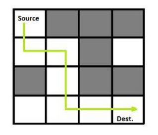
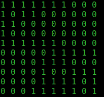

# Maze solver

C program that reads in a user defined maze, solves it using the stack data structure. Mazes are defined as a matrix of 1s and 0s; with 0s representing the walls and 1s representing the positions a rat could occupy.

Program assumes there is a valid solution to reach the bottom right corner, from any point of entry; behaviour is undefined if there is none.

## Illustration

## Sample input

## Known Failure modes

1. No exit at bottom right corner
2. No solution
